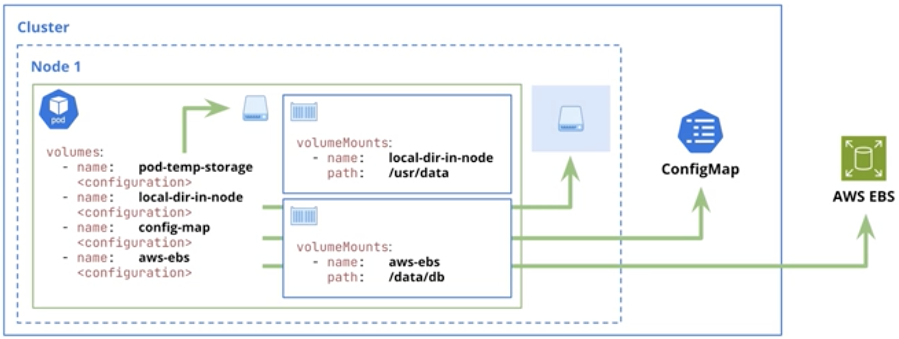

# Storage and Data Persistence
- [Kubernetes Volume Types](#kubernetes-volume-types)
- [Manifest Explanation](#manifest-explanation)
- [Examples](#examples)




## Kubernetes Volume Types
### EmptyDir
An EmptyDir volume is a **temporary storage volume** that is created when a Pod is scheduled onto a node and exists only for the lifetime of that Pod. It starts empty and can be used for sharing files between containers in the same Pod, caching data, or storing temporary computation results. The data is stored on the node’s filesystem (or in memory if configured with ```medium: Memory```) and is deleted permanently when the Pod is removed or rescheduled.

- **emptyDir** volumes are ephemeral and defined at the Pod level.
- The volume is created when the Pod is assigned to a node.
- The volume is initially empty.
- All containers in the Pod can read and write the same files in the emptyDir volume.
- Containers might mount the volume in different paths.
- When a Pod is removed from a node, the data in the emptyDir is deleted permanently.
- Data follows the Pod's lifecycle.

#### Use Case of Ephemeral Storage
A classic example for emptyDir is for temporary logging or caching. Imagine you have a web server container and a log-processing container in the same Pod. The web server writes access logs to a file in an emptyDir volume, and the log-processing container reads those logs from the same volume to analyze them.

Since these logs are temporary and only needed while the Pod is running, and they don't need to persist if the Pod restarts or is deleted, emptyDir is perfect. It provides a fast, local scratch space that's automatically cleaned up when the Pod is gone.

### Local
A Local volume represents a disk, partition, or directory that is physically attached to a specific Kubernetes node. Unlike EmptyDir, the data can persist beyond Pod restarts but is **tightly coupled to the node**, meaning Pods using it must be scheduled on the same node. Local volumes are typically used for high-performance workloads like databases where low latency is critical, but they reduce scheduling flexibility and require careful node management.

- **Local volumes** are persistent and defined at the Node level.
- kube-scheduler knows how to assign Pods to Nodes based on the affinity constraints defined in the PersistentVolume configuration.
- Setting a **PersistentVolume nodeAffinity** is mandatory when using local volumes.
- Like other **PersistentVoLumes**, it requires creating **PersistentVoLumeClaims** so that Pods can use the storage.
- Only supports static provisioning.
- Data follows the Node's lifecycle.

### Persistent Volume (PV)
A Persistent Volume is a cluster-level storage abstraction that represents durable storage provisioned by an administrator or dynamically via a storage class. It decouples storage from Pod lifecycles, allowing data to persist even when Pods are deleted or recreated. Pods consume Persistent Volumes through Persistent Volume Claims (PVCs), enabling portability, resilience, and consistent storage usage across different environments.

#### Persistent Volume Claim (PVC)
A Persistent Volume Claim (PVC) is a Kubernetes object that allows a Pod to request persistent storage without needing to know the underlying storage implementation. Instead of directly referencing a physical disk, cloud volume, or network storage, a Pod declares a PVC with specific requirements such as storage size, access modes (e.g., **ReadWriteOnce**, **ReadOnlyMany**, **ReadWriteMany**), and optionally a **StorageClass**. Kubernetes then matches the claim to a suitable Persistent Volume (PV) or dynamically provisions one if supported.

PVCs decouple application workloads from storage infrastructure, making applications more portable, scalable, and resilient. When a Pod is deleted or recreated, the PVC can remain intact, preserving data across Pod lifecycles. This abstraction is essential for stateful workloads like databases and message queues, as it enables reliable data persistence while allowing administrators to manage storage policies, performance characteristics, and lifecycle independently from application deployments.

- Claims are bound to a single PersistentVolume, and a PersistentVolume can have at most one claim bound to it.

##### Access modes:
- **ReadWriteOnce:** the volume can be mounted as read-write by a single node, and can be used by any number of Pods within that node.
- **ReadOnlyMany:** the volume can be mounted as read-only by many nodes.
- **ReadWriteMany:** the volume can be mounted as read-write by many nodes.
- **ReadWriteOncePod:** the volume can be mounted as read-write by a single-pod.

##### Static Provisioning of Persistent Volumes
In static provisioning, a cluster administrator manually creates Persistent Volumes (PVs) in advance, each backed by a specific storage resource such as a local disk, NFS share, or cloud volume. These PVs are predefined with fixed capacity, access modes, and reclaim policies, and they exist independently of any Pod or Persistent Volume Claim (PVC). When a PVC is created, Kubernetes searches for an available PV that matches the claim’s requirements and binds them together. Static provisioning gives administrators tight control over storage but requires upfront planning and manual management, which can be operationally heavy in large or dynamic environments.

##### Dynamic Provisioning of Persistent Volumes
Dynamic provisioning allows Kubernetes to automatically create a Persistent Volume when a PVC is submitted, as long as a suitable **StorageClass** is specified. The **StorageClass** defines how and where the storage is provisioned, such as the type of disk, performance tier, or cloud provider volume. This approach eliminates the need to pre-create PVs, making it ideal for cloud-native and scalable environments where storage needs change frequently. Dynamic provisioning improves developer experience and automation, while still allowing administrators to enforce policies through StorageClasses and reclaim rules.

- Dynamic provisioning is quite clever. Instead of an administrator pre-creating PVs, a **StorageClass** is used. When a Pod requests storage via a PVC, and that PVC references a StorageClass, the StorageClass automatically provisions a new PV for that PVC.
-  Dynamic provisioning automates the creation of Persistent Volumes, freeing administrators from manually pre-provisioning storage. This makes managing storage much more efficient and scalable, especially in environments where storage needs change frequently.

#### Use Case of Persistent Storage
The most common and critical example for persistent storage is a database. Think about a PostgreSQL or MySQL database. If the Pod running your database server were to restart or be deleted, you absolutely would not want to lose all your application's data! Persistent storage ensures that the database files (the actual data) remain intact and available, even if the Pod that was using them disappears. When a new database Pod starts up, it can simply re-attach to the existing persistent storage and continue operating with all its data. This is why its ability to outlive Pods is so critical for stateful applications.

### ConfigMap
A ConfigMap volume is used to inject **non-sensitive configuration data**, such as application settings or configuration files, into a container at runtime. The data can be mounted as files or exposed as environment variables, allowing applications to be configured without rebuilding images. ConfigMaps promote separation of configuration from code and make applications easier to manage and update.

### Secret
A Secret volume is designed to store and expose **sensitive information** such as passwords, API keys, tokens, or certificates. Like ConfigMaps, Secrets can be mounted as files or provided as environment variables, but they are base64-encoded and handled more securely by Kubernetes. Using Secrets reduces the risk of exposing sensitive data in images, source code, or logs and is essential for secure application deployments.

## Manifest Explanation
- [Pod with EmptyDir Manifest](#pod-with-emptydir-manifest)
- [Persistent Valume Manifest](#persistentvolume-manifest)

### Pod with EmptyDir Manifest
This YAML defines a Pod that utilizes an ephemeral storage volume. It’s the standard way to provide a container with temporary workspace that doesn't persist if the Pod is deleted, but survives container crashes.

```
apiVersion: v1
kind: Pod
metadata:
  name: empty-dir-demo
  labels:
    app: empty-dir-demo
spec:
  containers:
    - name: empty-dir-demo
      image: busybox:latest
      command: [ "sh", "-c", "sleep 3600" ]
      resources:
        requests:
          memory: "64Mi"
          cpu: "250m"
        limits:
          memory: "128Mi"
          cpu: "500m"
      volumeMounts:
        - name: temporary-storage
          mountPath: /usr/share/temp
  volumes:
    - name: temporary-storage
      emptyDir: {}
      #  medium: Memory
      #  sizeLimit: "10Mi"
```
#### 1. Identification (The "Who")
**apiVersion**: v1: Uses the core Kubernetes API version.

**kind**: Pod: The smallest execution unit in K8s.

**metadata**:
- **name**: empty-dir-demo: The unique identifier for this Pod within its namespace.
- **labels**: The app: empty-dir-demo tag allows Services or NetworkPolicies to find and target this specific Pod.

#### 2. Resource Management (The "How much")
Inside the spec.containers, we have defined Resource Quotas. This is critical for preventing "noisy neighbor" syndrome in a shared cluster.

- **Requests**: (64Mi RAM / 250m CPU) The guaranteed minimum. The scheduler uses this to find a Node with enough room. 250m (millicores) is equal to 0.25 of a single CPU core.
- **Limits**: (128Mi RAM / 500m CPU) The hard ceiling. If the container hits the RAM limit, it gets OOMKilled; if it hits the CPU limit, it gets throttled.

#### 3. Storage Logic (The emptyDir)
This is the heart of your manifest. It sets up a shared, temporary file system.

- **volumes**: Defines a volume named temporary-storage of type emptyDir. This creates a blank directory on the host Node when the Pod starts.
- **volumeMounts**: Maps that volume into the container at /usr/share/temp.
- **Lifecycle**: If the container crashes, the data in */usr/share/temp* stays. However, if the Pod is deleted or evicted from the node, the data is wiped permanently.
- **medium: Memory**: If you uncommented this, Kubernetes would mount a tmpfs (RAM-backed) filesystem. It’s incredibly fast but counts against your container’s memory limit.
- **sizeLimit**: This prevents a runaway process from filling up the entire Node's disk with temporary logs or cache files.

In a production pipeline, the emptyDir is used for:
- Scratch space for processing large files.
- Shared storage between two containers in the same Pod (a "Sidecar" pattern).
- Checkpoints for long-running computations.

### PersistentVolume Manifest
The following YAML defines a PersistentVolume (PV), which is a piece of storage in the cluster that has been provisioned by an administrator. While the emptyDir we looked at previously dies with the Pod, a PersistentVolume exists independently of any Pod.

The most important thing to notice here is that this is a Local Persistent Volume. Unlike cloud storage (like AWS EBS or GCE PD), this storage is physically tied to a specific node.

```
apiVersion: v1
kind: PersistentVolume
metadata:
  name: local-pv
spec:
  capacity:
    storage: 1Gi
  volumeMode: Filesystem
  accessModes:
    - ReadWriteOnce
  persistentVolumeReclaimPolicy: Retain
  storageClassName: local-storage
  local:
    path: /mnt/disks/local1
  nodeAffinity:
    required:
      nodeSelectorTerms:
        - matchExpressions:
            # kubectl describe node minikube
            - key: kubernetes.io/hostname
              operator: In
              values: ["minikube"]
```
#### 1. Storage Characteristics
- **capacity: storage: 1Gi**: This tells Kubernetes how much space is available. Note that Kubernetes doesn't actually "carve out" this space; it just uses this number for bookkeeping when matching the PV to a user's request (PVC).
- **volumeMode: Filesystem**: The volume will be mounted into Pods as a directory. The alternative is **Block**, which treats it as a raw block device (rarely used except for specialized databases).
- **accessModes: ReadWriteOnce**: This volume can be mounted as read-write by a single node at a time. This is standard for local disks.

#### 2. The Lifecycle (Reclaim Policy)
- **persistentVolumeReclaimPolicy: Retain**: This is a "safety first" setting.

If a developer deletes their PersistentVolumeClaim (the request for storage), this PV will move to a ***Released*** state.

Because of the Retain policy, Kubernetes will not delete the data or the PV. A cluster admin must manually clean up the disk and recreate the PV before it can be reused.

#### 3. The "Local" Constraint
The **local** and **nodeAffinity** blocks are what make this manifest unique.
- **local: path: /mnt/disks/local1**: This points to a specific directory on the host machine's physical hard drive. (Connect a physical path on a node to a Kubernetes PV.)
- **nodeAffinity**: This is mandatory for local volumes. Since the data is physically on the minikube node, Kubernetes needs to know that any Pod using this volume must be scheduled on that exact node Without this, the scheduler might try to start the Pod on "Node B," which can't see the physical disk on "Node A," causing a mount error.

#### Local vs. hostPath
You might see **hostPath** used in simple setups, but for production, **Local Persistent Volumes** are superior. Unlike **hostPath**, Kubernetes is "aware" of a local volume's node constraints. This allows the scheduler to be smarter about where it places Pods, preventing the "Pending" state loops common with misconfigured hostPath mounts.

### PersistentVolumeClaim Manifest
If the PersistentVolume (PV) is the actual hard drive installed in the server rack, the PersistentVolumeClaim (PVC) is the "voucher" or "request" a developer writes to claim that storage This separation allows developers to request storage without needing to know the underlying infrastructure details (like which physical disk or cloud volume is being used).
```
apiVersion: v1
kind: PersistentVolumeClaim
metadata:
  name: local-pvc
spec:
  resources:
    requests:
      storage: 1Gi
      #storage: 4Gi # must be less than or equal to the PV size
  volumeMode: Filesystem
  accessModes:
    - ReadWriteOnce
  storageClassName: local-storage # must match the storageClassName of the PV
```
#### 1. The Resource Request (spec.resources)
This is where the developer defines their requirements.

- **storage: 1Gi**: The PVC is looking for a PV that has at least 1Gi of space.

**The Matching Logic**: Kubernetes will look for a PV that satisfies this request. If you asked for 4Gi but only a 1Gi PV existed, the PVC would remain in a Pending state forever because the "voucher" cannot be fulfilled.

#### 2. The Binding Contract
For a PVC to successfully bind to a PV, several attributes must match exactly:

- **storageClassName: local-storage**: This is the "glue." The PVC will only look for PVs that have the same storage class name. In our previous example, the PV had ***storageClassName: local-storage***, so these two are compatible.

- **accessModes: ReadWriteOnce**: This confirms the developer only needs one node to be able to read and write to the disk at a time.

- **volumeMode: Filesystem**: This ensures the storage is delivered as a formatted directory, matching the PV's configuration.

#### 3. The Lifecycle: From Pending to Bound
When you kubectl apply this file, the Kubernetes Control Plane performs a matching loop:
1. User applies the PVC. ***Status: Pending***
2. K8s looks for a PV with storageClassName: local-storage and capacity >= 1Gi.	***Status: Searching***
3. K8s finds our local-pv from the previous step. ***Status: Matching***
4. K8s updates the PV to Claimed and the PVC to Bound. ***Status: Bound***

> **Note:** Once a PVC is Bound, that specific PV is "taken." No other PVC can use it until the first PVC is deleted and the PV is reclaimed (based on the persistentVolumeReclaimPolicy).

## Examples
- [EmptyDir Example](#emptydir-example)
- [Persistent Volume Example](#persistent-volume-example)

### EmptyDir Example
#### Create a Pod with busybox image
```
kubectl apply -f pod-with-empty-dir.yaml
```
This step creates a Pod that mounts an EmptyDir volume using a lightweight BusyBox container, allowing you to observe how temporary storage behaves in Kubernetes. When the Pod is created, Kubernetes allocates an empty directory on the node and mounts it into the container at the specified path. This storage is shared with the Pod and initialized fresh when the Pod starts.

#### Describe the Pod
```
kubectl describe pod empty-dir-demo
```
Running ```kubectl describe pod empty-dir-demo``` shows detailed information about the Pod, including the EmptyDir volume definition, mount paths, and container status. This confirms that the volume has been created and attached correctly. It also helps verify that the volume type is EmptyDir and where it is mounted inside the container.

#### Exec into the Pod and write data
```
kubectl exec -it empty-dir-demo -- sh

# Inside busybox:
cd /usr/share/temp
echo "Hello from temp storage" > demo.txt
```
By executing a shell inside the BusyBox container, you directly interact with the mounted EmptyDir volume. Writing demo.txt into **/usr/share/temp** demonstrates that the container can persist data within the Pod’s lifetime. This file is stored on the node and remains available as long as the Pod itself continues to exist.

#### Restart behavior within the same Pod
If the container restarts but the Pod is not recreated, the EmptyDir volume remains intact. This highlights that EmptyDir is bound to the Pod lifecycle rather than the container lifecycle, making it useful for temporary shared storage or caching across container restarts within the same Pod.

#### Delete and recreate the Pod
```
kubectl delete -f pod-with-empty-dir.yaml
kubectl apply -f pod-with-empty-dir.yaml
```
```
kubectl exec -it empty-dir-demo -- sh

# Inside busybox - No such file or directory:
cat /usr/share/temp/demo.txt
```
Deleting and recreating the Pod removes the original EmptyDir volume and creates a new, empty one. When you exec into the newly created Pod, the previously created file no longer exists. This confirms that EmptyDir data is lost once the Pod is terminated.

#### Delete Pod:
```
kubectl delete -f pod-with-empty-dir.yaml
```

#### Create reader and writer container
```
kubectl apply -f pod-with-empty-dir-reader-writer.yaml
```
This step creates a Pod with two containers—one writer and one reader—both mounting the same **EmptyDir** volume. This demonstrates how **EmptyDir** can be used to share data between containers within a single Pod, enabling simple inter-container communication or file-based coordination.

See empty-dir-writer and empty-dir-reader in the containers section:
```
kubectl describe pod empty-dir-demo
```

#### Write data from the writer container
```
kubectl exec -it empty-dir-demo -c empty-dir-writer -- sh

# Inside busybox container:
cd /usr/share/temp
echo "Hello from empty-dir-writer" > hello.txt
```
By exec’ing into the empty-dir-writer container and writing hello.txt into the shared directory, we show that one container can generate data and store it in the shared volume. The data is immediately available to other containers in the same Pod that mount the same EmptyDir.

#### Read data from the reader container
```
kubectl exec -it empty-dir-demo -c empty-dir-reader -- sh

# Inside busybox container:
cd /temp
cat hello.txt
```
Exec’ing into the empty-dir-reader container and reading hello.txt verifies that the shared volume works as expected. The reader container can access the file written by the writer, demonstrating safe and effective data sharing across containers in a Pod.

#### Read-only mount enforcement
Can't create hello-reader.txt: Read-only file system:
```
echo "Hello from empty-dir-reader" > hello-reader.txt
```
Attempting to write a file from the reader container fails because the volume is mounted as read-only for that container. This shows how Kubernetes allows different mount permissions per container, enforcing access control even when containers share the same volume.

#### Delete the Pod
```
kubectl delete -f pod-with-empty-dir-reader-writer.yaml
```
Deleting the Pod removes all containers and permanently deletes the EmptyDir volume along with its data. This final step reinforces the concept that EmptyDir storage is ephemeral and strictly scoped to the lifetime of the Pod.

### Persistent Volume Example

#### Create the Persistent Volume (PV)
```
kubectl apply -f local-persistent-volume.yaml
```
Applying local-persistent-volume.yaml creates a statically provisioned Persistent Volume backed by local node storage. This PV advertises fixed capacity, access modes, a reclaim policy, and a node-specific path, making it available for binding to a matching **Persistent Volume Claim**. At this stage, the PV exists independently of any Pod.

#### Verify the Persistent Volume
```
kubectl get pv
kubectl get persistentvolume

kubectl describe pv local-pv
kubectl describe persistentvolume local-pv
```
Using ```kubectl get pv``` and ```kubectl describe pv local-pv``` confirms that the Persistent Volume is created and shows its capacity, access modes, storage class, reclaim policy, and status. This step validates that the PV is available and ready to be claimed by a PVC.

#### Create the Persistent Volume Claim (PVC)
```
kubectl apply -f local-persistent-volume-claim.yaml
```
Applying local-persistent-volume-claim.yaml creates a PVC that requests storage with specific size and access requirements. Kubernetes attempts to match this PVC with an existing PV that satisfies those requirements. If no compatible PV is found, the claim remains unbound.

#### Handle PVC size mismatch
```
kubectl get pvc
kubectl describe pvc local-pvc
```
If the PVC requests more storage than the PV provides, the PVC remains in the ***Pending*** state and the describe output explains the failure (*"ProvisioningFailed persistentvolume-controller  storageclass.storage.k8s.io "local-storage" not found"*). This demonstrates that Kubernetes strictly enforces capacity and storage class compatibility when binding claims to volumes.

#### Recreate PVC with valid size
```
kubectl delete -f local-persistent-volume-claim.yaml
kubectl apply -f local-persistent-volume-claim.yaml
```
Deleting and recreating the PVC with a storage request less than or equal to the PV capacity allows Kubernetes to successfully bind the PVC to the PV. The status changes to ***Bound***, confirming that the claim and volume are now linked.

#### Verify PV–PVC binding
```
kubectl get pv,pvc
kubectl get persistentvolume,persistentvolumeclaim
```
Running ```kubectl get pv,pvc``` shows the PV in a ***Bound*** state and the PVC referencing it. This confirms that the storage request has been satisfied and is ready to be consumed by Pods.

#### Create a Pod that uses the PVC
```
kubectl apply -f pod-with-local-storage.yaml
```
Applying pod-with-local-storage.yaml creates a Pod that mounts the PVC into a container. Although the PV and PVC exist, the Pod initially fails to start because the underlying local path defined in the PV (```path: /mnt/disks/local1```) does not yet exist on the node. ```kubectl get pods``` displays the status stuck in ContainerCreating.

#### Diagnose the mount failure
```
kubectl describe pod local-storage-pod
```
Describing the Pod reveals a FailedMount error (*"FailedMount  MountVolume.NewMounter initialization failed for volume "local-pv" : path "/mnt/disks/local1" does not exist"*) indicating that the local path does not exist on the node. This highlights a key requirement of local Persistent Volumes: the physical directory must already exist on the node.

#### Prepare the local path on the node
Delete pod:
```
kubuctl delete pod local-storage-pod
kubectl delete -f pod-with-local-storage.yaml
```

```
minikube ssh
sudo mkdir -p /mnt/disks/local1
sudo chmod 777 /mnt/disks/local1
exit
```
By SSH’ing into the Minikube node and creating the **/mnt/disks/local1** directory with appropriate permissions, you prepare the underlying storage location required by the local PV. This step bridges Kubernetes configuration with actual node-level storage. The **-p** flag ensures that parent directories are created if they don't exist.

#### Recreate the Pod and verify it runs
```
kubectl apply -f pod-with-local-storage.yaml
```
After recreating the Pod, Kubernetes successfully mounts the local PV, and the Pod transitions to the Running state. This confirms that the PV, PVC, and node filesystem are now correctly aligned.

#### Write data from inside the container
```
kubectl exec -it local-storage-pod -c busybox-container -- sh

# Go to defined mount path inside container:
cd mnt/local/
echo "Hello from local-storage-pod" > hello.txt
```
Exec’ing into the container and writing a file to the mounted path demonstrates that the Pod can persist data to the local Persistent Volume. The data is written directly to the node’s filesystem through the PV.

#### Verify data on the node
```
minikube ssh
cat /mnt/disks/local1/hello.txt
```
Accessing the file from the Minikube node confirms that the data is physically stored on the node. This validates that the Persistent Volume truly maps to node-level storage rather than ephemeral container storage.

#### Restart the Pod and confirm persistence
The file still exist:
```
kubectl delete -f pod-with-local-storage.yaml
kubectl apply -f pod-with-local-storage.yaml
kubectl exec -it local-storage-pod -c busybox-container -- sh
cat /mnt/local/hello.txt
```
Deleting and recreating the Pod shows that the file still exists, proving that the data is not tied to the Pod or container lifecycle. The Persistent Volume preserves data across Pod restarts.

#### Attach the same PV to a different Pod
```
kubectl apply -f pod2-with-local-storage.yaml
kubectl exec -it local-storage-pod2 -c busybox-container -- sh
cat /mnt/local2/hello.txt
```
Creating a second Pod that mounts the same PVC demonstrates storage decoupling from individual Pods. The new Pod can read the same data, showing how PVCs enable data sharing and reuse.

#### Delete the Persistent Volume Claim
```
kubectl delete -f local-persistent-volume-claim.yaml
```
Deleting the PVC releases the claim, and the PV transitions to the ***Released*** state. Because the reclaim policy is ***Retain***, Kubernetes does not delete the underlying data or make the PV reusable automatically.

#### Delete the Persistent Volume
```
kubectl delete -f local-persistent-volume.yaml
```
Deleting the PV removes the Kubernetes object but does not delete the actual files on the node. This emphasizes that with a ***Retain policy***, administrators must manually clean up storage if needed.

#### Confirm data still exists on the node
```
kubectl apply -f pod2-with-local-storage.yaml
kubectl exec -it local-storage-pod2 -c busybox-container -- sh
cat /mnt/local2/hello.txt
```
Even after deleting both the PVC and PV, the data remains accessible on the node’s filesystem. This final step reinforces the concept that Persistent Volumes with a Retain policy protect data beyond Kubernetes object lifecycles.

#### Cleanup Resources
```
kubectl delete -f pod-with-local-storage.yaml -f pod2-with-local-storage.yaml -f local-persistent-volume-claim.yaml -f local-persistent-volume.yaml
```